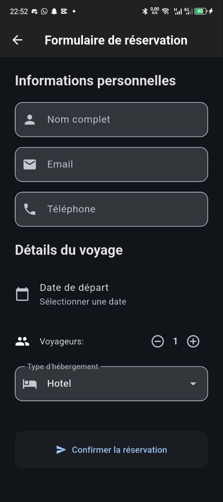
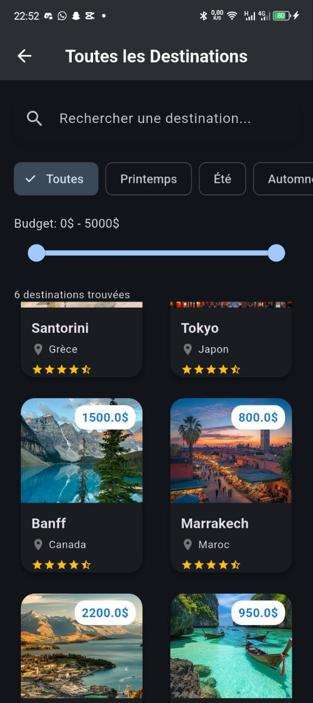
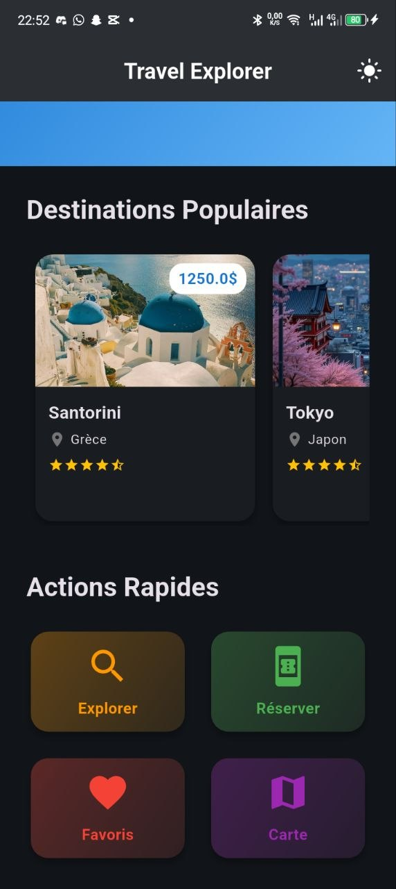
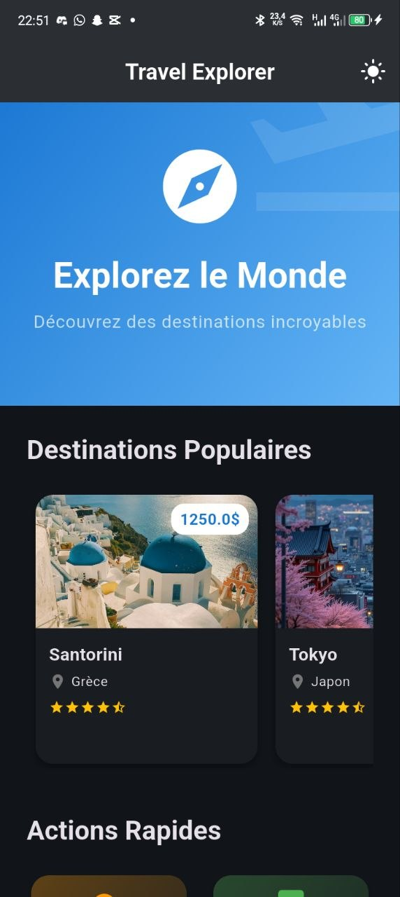
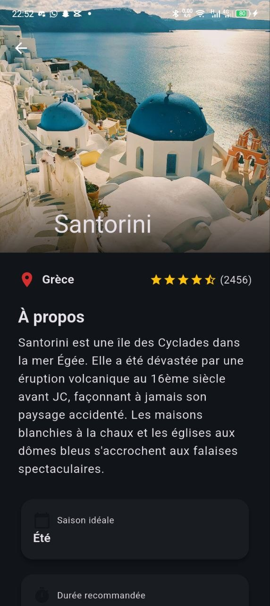

# Travel Explorer App

Une application Flutter multi-écrans pour explorer et réserver des destinations de voyage.

## Fonctionnalités

-  **Écran d'accueil** : Destinations populaires, actions rapides et basculement clair/sombre
-  **Liste des destinations** : Recherche, filtrage par saison et budget, avec grille responsive
-  **Détails des destinations** : Informations complètes, activités, réservation
-  **Formulaire de réservation** : Validation du nom, de l’e-mail et du téléphone
-  **Favoris et carte** : Deux écrans supplémentaires accessibles depuis l’accueil
-  **Thème clair/sombre** : Basculement dynamique depuis l’accueil
-  **Responsive** : Adaptation mobile et tablette

## Widgets Utilisés

- ListView, GridView, Stack, Card, SliverAppBar
- TextFormField, DropdownButtonFormField, RangeSlider
- FilterChip, Chip, AlertDialog
- Et plus...

## Widgets Réutilisables

- `DestinationCard` : Carte de destination
- `CustomSearchBar` : Barre de recherche
- `RatingStars` : Étoiles de notation

## Installation

1. Assurez-vous d'avoir Flutter installé
2. Clonez le dépôt : `git clone (https://github.com/jkatems/travel_app)`
3. Installez les dépendances : `flutter pub get`
4. Lancez l'application : `flutter run`

## Qualité

Les tests unitaires et widgets couvrent les données, la navigation, les images,
la recherche et les validations du formulaire. Exécutez-les avec :

```bash
flutter analyze
flutter test
```

Le pipeline GitHub Actions (`.github/workflows/flutter_ci.yml`) exécute ces
contrôles à chaque pull request et à chaque mise à jour de `main`.

## Captures d'écran

     

## Technologies

- Flutter 3.0+
- GoRouter pour la navigation
- Google Fonts
- Material Design 3

## Structure du Projet

lib/

├── models/  Modèles de données

├── data/ # Données mockées

├── screens/ # Écrans de l'application

├── widgets/ # Widgets réutilisables

├── theme/ # Thèmes clair/sombre

└── router/ # Configuration de la navigation
